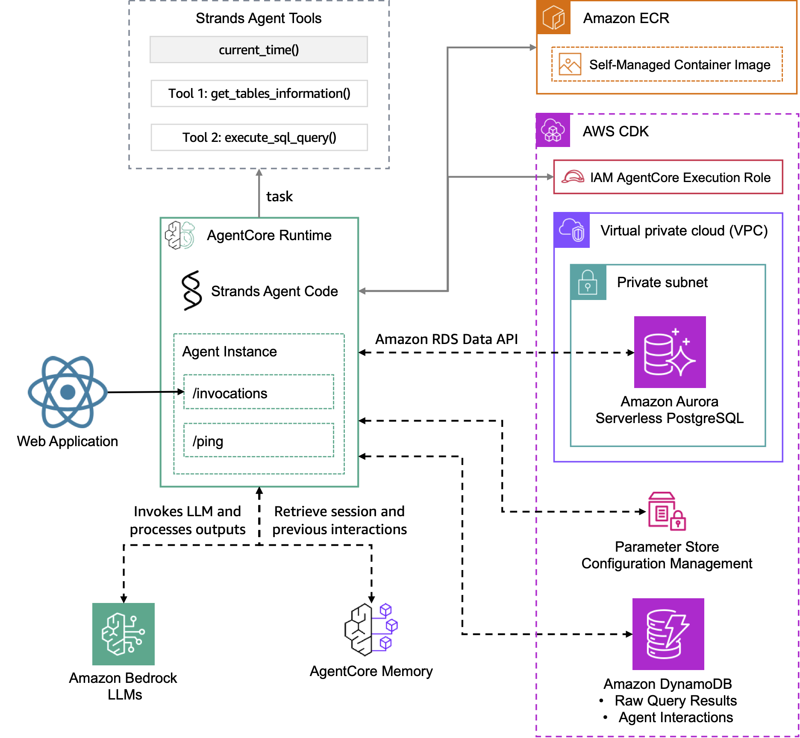
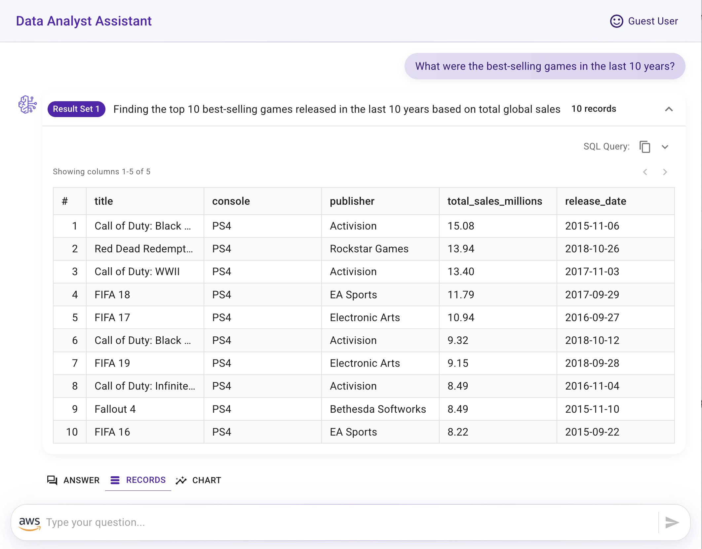

# Deploying a Conversational Data Analyst Assistant Solution with Amazon Bedrock AgentCore

This solution provides a Generative AI application reference that allows users to interact with data through a natural language interface. The solution leverages **[AWS Bedrock AgentCore](https://aws.amazon.com/bedrock/agentcore/)**, a managed service that enables you to deploy, run, and scale custom agent applications, along with the **[Strands Agents SDK](https://strandsagents.com/)** to build an agent that connects to a PostgreSQL database, providing data analysis capabilities through a web application interface.

🤖 A Data Analyst Assistant offers an approach to data analysis that enables enterprises to interact with their structured data through natural language conversations rather than complex SQL queries. This kind of assistant provides an intuitive question-answering for data analysis conversations and can be improved by offering data visualizations to enhance the user experience.

✨ This solution enables users to:

- Ask questions about video game sales data in natural language
- Receive AI-generated responses based on SQL queries to a PostgreSQL database
- View query results in tabular format
- Explore data through automatically generated visualizations
- Get insights and analysis from the AI assistant

🚀 This reference solution can help you explore use cases like:

- Empower analysts with real-time business intelligence
- Provide quick answers to C-level executives for common business questions
- Unlock new revenue streams through data monetization (consumer behavior, audience segmentation)
- Optimize infrastructure through performance insights

## Solution Overview

The following architecture diagram illustrates a reference solution for a generative AI data analyst assistant that is built using Strands Agents SDK and powered by Amazon Bedrock. This assistant enables users to access structured data that is stored in a PostgreSQL database through a question-answering interface.

> [!IMPORTANT]
> This sample application is meant for demo purposes and is not production ready. Please make sure to validate the code with your organizations security best practices.

### AgentCore Runtime & Memory Infrastructure

**Amazon Bedrock AgentCore** is a fully managed service that enables you to deploy, run, and scale your custom agent applications with built-in runtime and memory capabilities.

- **AgentCore Runtime**: Provides the managed execution environment with invocation endpoints (`/invocations`) and health monitoring (`/ping`) for your agent instances
- **AgentCore Memory**: A fully managed service that gives AI agents the ability to remember, learn, and evolve through interactions by capturing events, transforming them into memories, and retrieving relevant context when needed

The AgentCore infrastructure handles all storage complexity and provides efficient retrieval without requiring developers to manage underlying infrastructure, ensuring continuity and traceability across agent interactions.

### CDK Infrastructure Deployment

The AWS CDK stack deploys and configures the following managed services:

- **IAM AgentCore Execution Role**: Provides necessary permissions for Amazon Bedrock AgentCore execution
- **VPC and Private Subnet**: Network isolation and security for database resources
- **Amazon Aurora Serverless PostgreSQL**: Stores the video game sales data with RDS Data API integration
- **Amazon DynamoDB**: Tracks raw query results and agent interactions
- **Parameter Store Configuration Management**: Securely manages application configuration

### Strands Agent Features

| Feature | Description |
|----------|----------|
| Native Tools   | current_time - A built-in Strands tool that provides the current date and time information based on user's timezone. |
| Custom Tools | get_tables_information - A custom tool that retrieves metadata about the database tables, including their structure, columns, and relationships, to help the agent understand the database schema. execute_sql_query - A custom tool that allows the agent to run SQL queries against the PostgreSQL database based on the user's natural language questions, retrieving the requested data for analysis. |
| Model Provider | Amazon Bedrock |

> [!NOTE]
> This solution references the use of AWS IAM credentials to connect to Amazon Bedrock AgentCore and Amazon DynamoDB. 🚀 For production deployment, consider integrating Amazon Cognito or another identity provider for proper authentication and authorization instead of using IAM user credentials.

> [!TIP]
> You can also change the data source to connect to your preferred database engine by adapting the Agent's instructions and tool implementations.

> [!IMPORTANT] 
> Enhance AI safety and compliance by implementing [Amazon Bedrock Guardrails](https://aws.amazon.com/bedrock/guardrails/) for your AI applications with the seamless integration offered by **[Strands Agents SDK](https://strandsagents.com/latest/user-guide/safety-security/guardrails/)**.

The **user interaction workflow** operates as follows:

- The web application sends user business questions to the AgentCore Invoke
- The Strands Agent (powered by Claude 3.7 Sonnet) processes natural language and determines when to execute database queries
- The agent's built-in tools execute SQL queries against the Aurora PostgreSQL database and formulate an answer to the question
- AgentCore Memory captures session interactions and retrieves previous conversations for context
- After the agent's response is received by the web application, the raw data query results are retrieved from the DynamoDB table to display both the answer and the corresponding records
- For chart generation, the application invokes a model (powered by Claude 3.5 Sonnet) to analyze the agent's answer and raw data query results to generate the necessary data to render an appropriate chart visualization

## Deployment Instructions

The deployment consists of two main steps:

1. **Back-End Deployment** - [Data Source and Configuration Management Deployment with CDK](./cdk-agentcore-strands-data-analyst-assistant/)
1. **Agent Deployment** - [Strands Agent Infrastructure Deployment with AgentCore](./agentcore-strands-data-analyst-assistant/)
2. **Front-End Implementation** - [Integrating AgentCore with a Ready-to-Use Data Analyst Assistant Application](./amplify-video-games-sales-assistant-agentcore-strands/)

> [!NOTE]
> *It is recommended to use the Oregon (us-west-2) or N. Virginia (us-east-1) regions to deploy the application.*

> [!IMPORTANT] 
> Remember to clean up resources after testing to avoid unnecessary costs by following the clean-up steps provided.

## Application Features

The following images showcase a conversational experience analysis that includes: natural language answers, the reasoning process used by the LLM to generate SQL queries, the database records retrieved from those queries, and the resulting chart visualizations.

- **Conversational interface with an agent responding to user questions**

- **Raw query results displayed in tabular format**

- **Chart visualization generated from the agent's answer and the data query results (created using [Apexcharts](https://apexcharts.com/))**.

- **Summary and conclusion derived from the data analysis conversation**

## Thank You

## License

This project is licensed under the Apache-2.0 License.